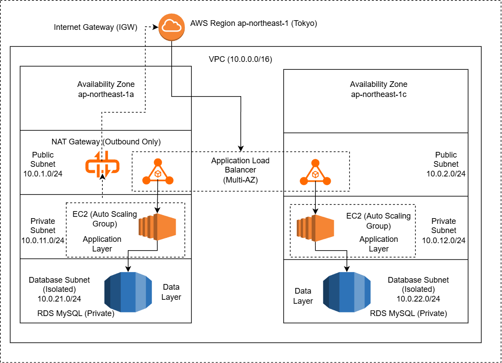

# AWS 3-Tier Network Infrastructure via Terraform

Terraform で AWS の標準 3 層構成（Web / App / DB）を自動構築する IaC プロジェクトです。  
Public / Private / Isolated の境界分離と、Security Group による段階的制御（ALB → EC2 → RDS）を重視し、
「安全に動く標準構成」を再現性高くデプロイできる状態を作成しました。

---

## Key Highlights（特徴）

- **責務分離を意識した3層設計**（Public / Private / Isolated）
- **最小権限の通信制御**（SG 参照による段階的制御）
- **実務を意識したIaC設計**（変数化・Outputs・機密情報分離）
- **拡張前提の構成設計**（ALB + ASG、将来的なMulti-AZ対応）

---

## Architecture（構成）



本構成は、クラウド移行初期フェーズや中小規模 Web システムで採用されやすい  
標準的な 3 層アーキテクチャを想定しています。

---

### Communication Flow（通信経路）

| From      | To   | Port | Purpose |
|:--------|:-----|:----:|:--------|
| Internet  | ALB  | 80   | HTTP リクエスト受信 |
| ALB       | EC2  | 80   | アプリケーション転送 |
| EC2       | RDS  | 3306 | データベース接続 |
| EC2       | NAT Gateway | 443 | OSアップデート等のアウトバウンド通信 |

本構成では、上記以外の通信は Security Group により遮断されます。

※ 外部公開が必要な ALB を除き、内部通信は Security Group 間参照により制御しています。

---

### Layer Design（レイヤ設計）

#### Public Layer
- Application Load Balancer（ALB）を配置
- 外部からの HTTP リクエストを受信
- Public Subnet には EC2 を置かず、入口を ALB に集約

#### Private Layer（Application）
- EC2（Auto Scaling Group）を配置
- パブリック IP を付与せず、インターネットからの直接アクセスを遮断
- アウトバウンド通信は NAT Gateway 経由に限定

#### Isolated Layer（Database）
- Amazon RDS（MySQL）を配置
- Internet Gateway / NAT Gateway へのルートを持たない完全隔離サブネット
- ネットワークレベルで DB を保護し、攻撃対象領域を最小化

---

## Target Use Case（想定ユースケース）

- 中小規模 Web アプリケーション
- 社内業務システム（B2B）
- クラウド移行初期の標準構成（3層アーキテクチャ）

---

## Tech Stack（技術スタック）

- **Cloud**: AWS  
- **IaC**: Terraform (v1.5.0+)  
- **Compute**: EC2 / Auto Scaling Group  
- **Load Balancer**: Application Load Balancer  
- **Database**: Amazon RDS (MySQL 8.0)  
- **OS**: Amazon Linux 2023  
- **Security**: Security Group による段階的制御  

---

## Resource Components（構成リソース）

- **VPC**: `10.0.0.0/16`

- **Subnets (Multi-AZ)**
  - Public (2AZ): ALB 用
  - Private (2AZ): EC2 用（NAT Gateway 経由でアウトバウンド可）
  - Isolated DB (2AZ): RDS 用（アプリケーション層からのみアクセス許可）

- **Compute**
  - Launch Template + Auto Scaling Group（例: `t3.micro`）

- **Database**
  - Amazon RDS（MySQL）
  - Isolated Subnet に配置し、EC2 からのみ接続可能
  - ※ 検証用途のため RDS は Single-AZ 構成（本番では要件に応じ Multi-AZ を想定）

---

## Design Notes（設計背景）

設計判断の背景やトレードオフ（NAT / SG 設計 / Remote State 等）は  
`docs/design-notes.md` にまとめています。

特に意識した点：

- **最小権限の通信制御**（ALB → EC2 → RDS のみ）
- **ネットワーク境界の明確化**（Public / Private / Isolated）
- **運用を見据えた IaC**（変数化・Outputs・機密情報の扱い）

---

## Usage（使い方）

> 事前に AWS 認証情報（AWS CLI / 環境変数など）の設定が必要です。  
> `db_password` は実行時入力、または `terraform.tfvars` にて指定してください  
> （機密情報のため Git 管理対象外）。

```bash
# リポジトリのクローン
git clone https://github.com/LIYICHENG1874/aws-3tier-terraform.git
cd aws-3tier-terraform

# 初期化
terraform init

# 実行計画
terraform plan

# デプロイ
terraform apply

# 削除（後片付け）
terraform destroy

```

---

## Scope（本プロジェクトの範囲）

本リポジトリは、  
**「3層構成におけるネットワーク境界設計」および  
「Terraform による再現性のある構築」** を主目的としています。

VPC / Subnet 設計、Security Group による通信制御、  
ALB / EC2 / RDS の基本構成、および Terraform による IaC 化を中心に構成しています。

---

## Future Work（拡張案）

本構成をベースに、要件に応じて以下のような拡張が可能です。

- CloudWatch を用いた監視・ログ設計の追加  
- ACM + ALB による HTTPS 化、および WAF によるセキュリティ強化  
- GitHub Actions を用いた CI/CD パイプラインの構築  
- S3 + DynamoDB を用いた Terraform Remote State の導入  
- NAT Gateway の AZ 冗長化（可用性要件に応じて）  
- コスト最適化および運用自動化の検討  

---

## Related Repository（関連リポジトリ）

本構成上で動作するバックエンドの検証プロジェクトはこちら：

- **Backend Workload Verification (EC2 / RDS 動作検証)**  
  <https://github.com/LIYICHENG1874/ec2-backend-verification>

